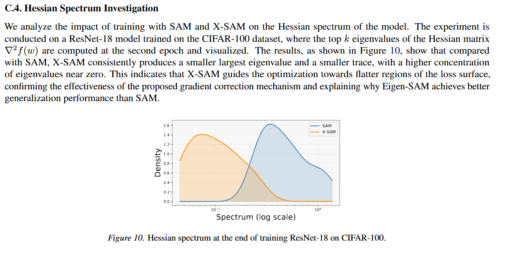

# X-SAM-Rebuttal
Supplementary materials and experimental results for paper
### Hessian Spectrum Investigation
To further validate the flatness-seeking capability of our method, we visualize the Hessian eigenvalue spectrum as follows:

*Figure 1: Comparison of the Hessian eigenvalue spectrum. Our method effectively suppresses the dominant eigenvalues, leading to a flatter local minimum.*
